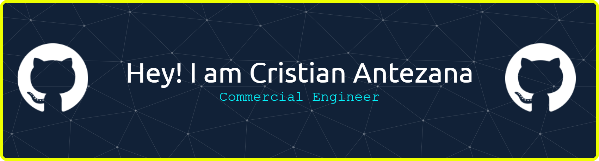

#     Welcome to my GitHub

 

I hold a *Bachelor of Business Administration* from UPLA (Chile), with a strong quantitative and analytical background. My journey combines business acumen with technical skills in programming and data analysis, preparing me to bridge the gap between business needs and technical solutions.

* 🌍  I'm based in Santiago, Chile
* ✉️  You can contact me at cristian.antezana.p@mail.pucv.cl
* 🧠  I'm currently learning Data Science and Databases.
* 💬 Building practical experience in data-related roles and developing projects that combine business strategy with data analysis
* 💬 Admitted to PUCV's Data Science Engineering program in 2026, currently in the 83rd percentile. [(📜 View certificate)](Ranking0126.pdf).

<!-- 
* 📄 Check out my Resume [here]()
-->

[comment]:# (Esto es un comentario)

## Technologies 💻

[comment]:# ( </a><a href="https://www.postgresql.org/" target="_blank" rel="noreferrer"> )

[comment]:# (</a><a href="https://www.mysql.com/" target="_blank" rel="noreferrer"> )

[comment]:# ( </a><a href="https://www.oracle.com/uk/index.html" target="_blank" rel="noreferrer"> )

## Beyond the Code 🌟
 * Military leadership experience  (Corporal, Chilean Army - Task Group Leadership)
 * Active volunteer with **Fundación Diente de León** (Autism support)
 * Team management experience leading groups of 6-80 people at PROSEGUR